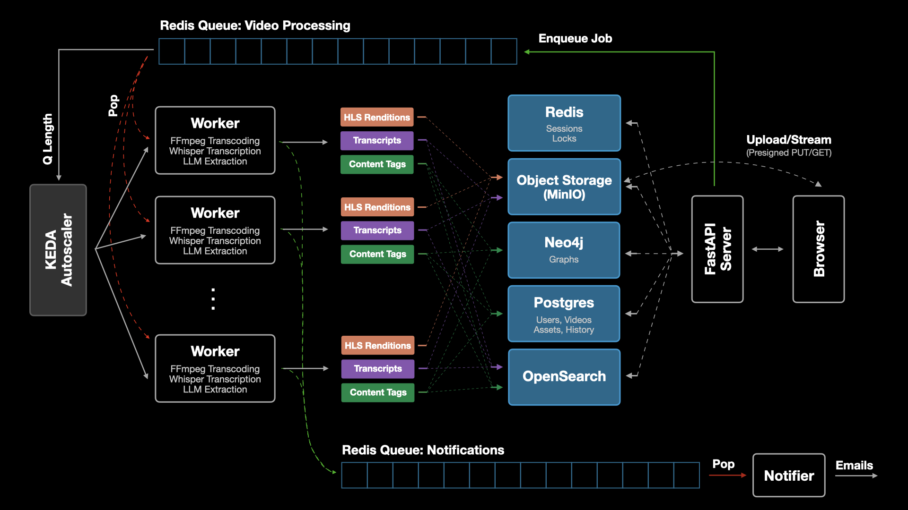
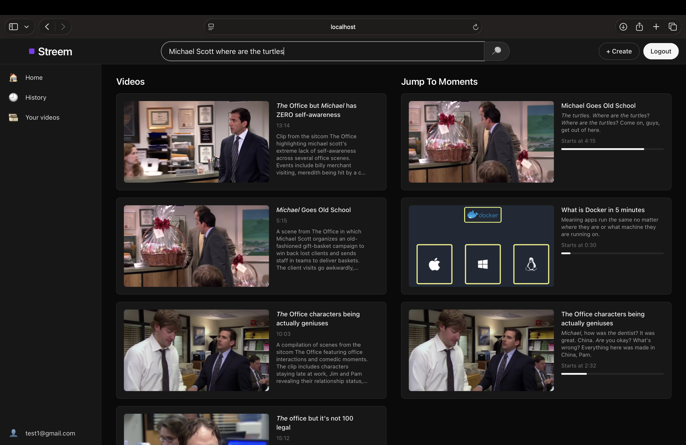

# Streem

A cloud-native, autoscaling video platform for upload, transcoding, search, and playback. It supports:

- **Direct Uploads**: Browser uploads to S3-compatible storage via presigned URLs
- **Background Processing**: HLS transcoding (720p/480p) with thumbnails and captions
- **Intelligent Search**: Search video content by metadata and transcripts ("jump to moments")
- **Watch History**: Resume playback with progress tracking
- **Home Feed**: Simple personalized recommendations
- **Email Notifications**: Alerts when videos are ready to watch


## Architecture 



### Overview:
- **API** (FastAPI): authentication, uploads, finalize, video detail/list, history, search, health
- **Web** (Next.js): UI for upload, playback, search, history, and home feed
- **Worker**: ffprobe, HLS (720p/480p), thumbnail, captions, indexing
- **Notifier**: sends "video ready" emails
- **PostgreSQL**: primary data store
- **Redis**: sessions, rate limits, queues, locks
- **MinIO**: S3‑compatible object storage for raw and processed assets
- **OpenSearch**: metadata and transcript search
- **Mailpit**: local SMTP for dev
- **Kubernetes (kind)**: orchestration
- **Autoscaling (KEDA)**: scales worker based on Redis queue length

For design choices and implementation details, see [design.md](docs/design.md).

## Fun transcript search example




## Run with Docker Compose

### Prerequisites
- Docker

### One‑command spinup
```bash
docker compose up --build
```

First boot pulls images and installs dependencies; give it a few minutes.

### Access URLs
- Web: http://localhost:3000
- API: http://localhost:8000 (docs at http://localhost:8000/docs)
- MinIO Console: http://localhost:9001 (login: `minioadmin` / `minioadmin`)
- Mailpit UI: http://localhost:8025

### Teardown (keep volumes)
```bash
docker compose down
```

### Teardown (remove volumes and orphans)
```bash
docker compose down --volumes --remove-orphans
```

## Run with Kubernetes (kind)

### Kubernetes Directory Structure

```
k8s/
├── kind/
│   └── cluster-config.yaml         # kind cluster configuration
├── config/   
│   ├── secrets.yaml                # Sensitive credentials
│   └── configmap.yaml              # Application configuration
├── stateful/   
│   ├── postgres.yaml               # PostgreSQL StatefulSet 
│   ├── redis.yaml                  # Redis StatefulSet 
│   ├── minio.yaml                  # MinIO StatefulSet 
│   ├── opensearch.yaml             # OpenSearch StatefulSet 
│   └── mailpit.yaml                # Mailpit Deployment 
├── app/   
│   ├── api.yaml                    # FastAPI backend Deployment 
│   ├── worker.yaml                 # Video processing worker Deployment
│   ├── worker-autoscaled.yaml      # KEDA-scaled worker 
│   ├── notifier.yaml               # Email notification Deployment 
│   └── web.yaml                    # Next.js frontend Deployment 
└── scripts/   
    ├── create-cluster.sh           # Creates kind cluster
    ├── deploy-all.sh               # Deploys all resources (standard)
    ├── deploy-with-autoscaling.sh  # Deploys with KEDA autoscaling
    ├── destroy-all.sh              # Deletes all resources
    ├── install-keda.sh             # Installs KEDA for autoscaling
    └── monitor-autoscaling.sh      # Monitors worker scaling behavior
```

### Prerequisites
- Docker
- kind
- kubectl
- helm
- k9s
- stern 

### Quick Start (Using Makefile)

#### Option 1: Standard Deployment

```bash
# Create cluster and deploy everything
make cluster && make deploy

# Watch pods come up (takes 5-10 minutes for first startup)
make watch

# Or use k9s for interactive UI
k9s -n streem
```

#### Option 2: With KEDA Autoscaling

```bash
# Create cluster, install KEDA, and deploy with autoscaling
make cluster && make install-keda && make deploy-with-autoscaling

# Monitor autoscaling behavior
make monitor-autoscaling

# Or use k9s for interactive UI
k9s -n streem
```

#### Available Make Commands

```bash
make help                     # Show all available commands
make cluster                  # Create kind cluster
make deploy                   # Deploy all resources (standard)
make install-keda             # Install KEDA for autoscaling
make deploy-with-autoscaling  # Deploy with KEDA worker autoscaling
make monitor-autoscaling      # Monitor worker autoscaling
make destroy                  # Delete all resources (keep cluster)
make clean                    # Delete kind cluster completely
make restart SERVICE=api      # Restart a specific service
make watch                    # Watch all pods
```

### Manual Deployment (Step-by-Step)

If you prefer manual control or want to understand the deployment process:

#### Step 1: Create Cluster
```bash
# Create kind cluster with configuration
kind create cluster --config k8s/kind/cluster-config.yaml

# Verify cluster
kubectl cluster-info --context kind-streem
kubectl get nodes
```

#### Step 2: Create Namespace
```bash
# Create namespace and set as default
kubectl create namespace streem
kubectl config set-context --current --namespace=streem
```

#### Step 3: Deploy Infrastructure
```bash
# Deploy stateful services (databases, storage, cache)
kubectl apply -f k8s/stateful/postgres.yaml
kubectl apply -f k8s/stateful/redis.yaml
kubectl apply -f k8s/stateful/minio.yaml
kubectl apply -f k8s/stateful/opensearch.yaml
kubectl apply -f k8s/stateful/mailpit.yaml

# Wait for stateful services to be ready
kubectl get pods -n streem -w
# Press Ctrl+C when all pods show READY 1/1
```

#### Step 4: Deploy Configuration
```bash
# Deploy secrets and configmaps
kubectl apply -f k8s/config/secrets.yaml
kubectl apply -f k8s/config/configmap.yaml
```

#### Step 5: Deploy Application
```bash
# Deploy application services
kubectl apply -f k8s/app/api.yaml
kubectl apply -f k8s/app/worker.yaml
kubectl apply -f k8s/app/notifier.yaml
kubectl apply -f k8s/app/web.yaml

# Watch all pods come up (takes 5-10 minutes for first startup)
kubectl get pods -n streem -w

# Or use k9s for interactive UI
k9s -n streem

# Or tail logs from all pods in namespace
stern . -n streem
```

### KEDA Autoscaling Setup

To enable automatic worker scaling based on Redis queue depth:

#### Step 1: Install KEDA
```bash
make install-keda
```

#### Step 2: Deploy with Autoscaling
```bash
# Using make
make deploy-with-autoscaling

# Or manually (deploy everything except regular worker, then deploy autoscaled worker)
kubectl apply -f k8s/stateful/
kubectl apply -f k8s/config/
kubectl apply -f k8s/app/api.yaml
kubectl apply -f k8s/app/notifier.yaml
kubectl apply -f k8s/app/web.yaml
kubectl apply -f k8s/app/worker-autoscaled.yaml  # Use autoscaled version
```

#### Step 3: Monitor Autoscaling
```bash
make monitor-autoscaling

# Or use k9s for interactive UI
k9s -n streem

# Or tail logs from all pods in namespace
stern . -n streem
```

### Access URLs

Once deployed, access the services:

- **Web App:** http://localhost:3000
- **API:** http://localhost:8000 (docs at http://localhost:8000/docs)
- **MinIO Console:** http://localhost:9001 (login: `minioadmin` / `minioadmin`)
- **Mailpit UI:** http://localhost:8025

### Debugging & Logs

#### Using k9s (Interactive Terminal UI)

```bash
# Launch k9s for the streem namespace
k9s -n streem

# Useful k9s shortcuts:
# :pods     - View pods
# :svc      - View services
# :deploy   - View deployments
# l         - View logs for selected resource
# d         - Describe resource
# s         - Shell into pod
# ctrl+d    - Delete resource
# :q        - Quit
```

#### Using stern (Multi-pod Log Tailing)

```bash
# Tail logs from all pods in namespace
stern . -n streem

# Tail logs from specific service
stern api -n streem
stern worker -n streem
stern notifier -n streem

# Filter by label
stern -l app=worker -n streem
```

### Teardown

```bash
# Delete all resources (using make)
make destroy       # Keep cluster, delete resources
make clean         # Delete cluster completely

# Or manually
kubectl delete -f k8s/app/
kubectl delete -f k8s/config/
kubectl delete -f k8s/stateful/

# Delete cluster
kind delete cluster --name streem
```